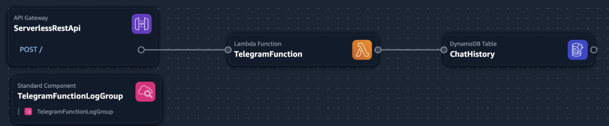
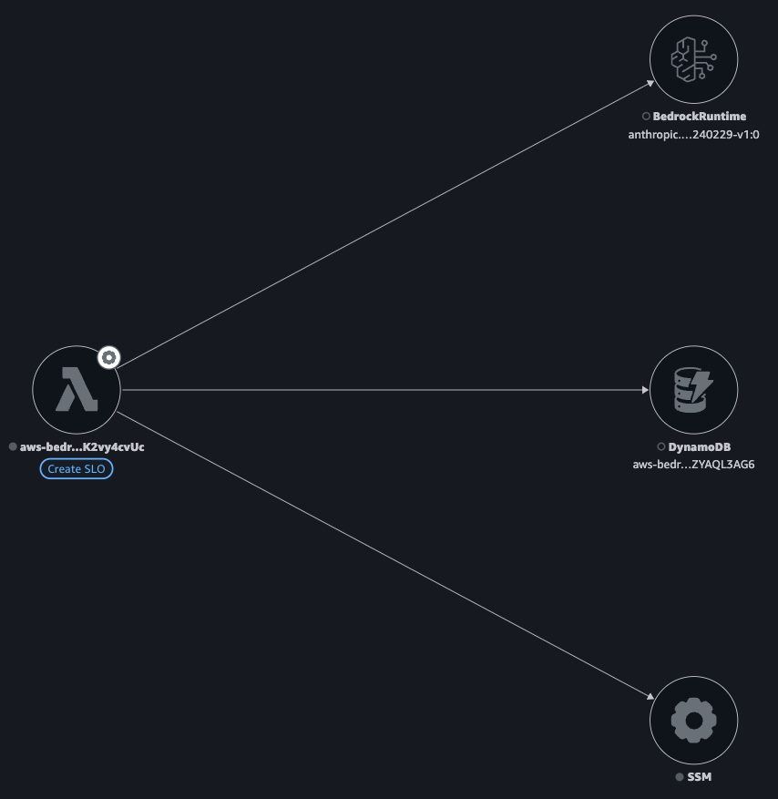

# AWS Bedrock Telegram GenAI Chatbot
Telegram conversational GenAI bot, powered by Amazon Bedrock, using PTB, hosted on AWS Serverless

- Uses the [python-telegram-bot](https://pypi.org/project/python-telegram-bot/) telegram bot framework, using [this project](https://github.com/jojo786/Sample-Python-Telegram-Bot-AWS-Serverless-PTBv20) to run PTB on AWS Serverless
- GenAI conversational capabilities powered by Amazon Bedrock, using the Claude Sonnet 4.5 LLM

# Architecture
Requests from Telegram come in via an Amazon API Gateway endpoint, which get routed to a Lambda function. The Lambda function gets the Telegram Token from SSM Parameter Store. Requests are sent to Amazon Bedrock. Chat history is maintained in DynamoDB. Logs are stored on CloudWatch. Telegram token stored securely in SSM using Lambda Powertools. All deployed using AWS SAM IaC. [Lambda SnapStart](https://hacksaw.co.za/blog/aws-lambda-snapstart-for-python/) is enabled to reduce cold starts and improve performance. Monitoring services like X-Ray, Lambda Insights and Application Signal are all enabled for comprehensive monitoring.

# How it works
- A Telegram bot has been created with the webhook URL set to point to the Amazon API Gateway endpoint. Now when ever a user interacts with the bot, the requests are send to API GW
- API Gateway receives the request and forwards to a Lambda function
- The Lambda function gets invoked and does a few things:
- - retrieves the Telegram token from SSM
- - manages the chat history, by storing the new chat request in DynamoDB, then retrieving the previous requests to build up the whole chat histor
- - sends the request to Bedrock, and parses the response
- - Saves the response in DynamoDB to main chat history
- - Sends the response back to the Telegram user

# How to run it
- Create your bot using [BotFather](https://core.telegram.org/bots#3-how-do-i-create-a-bot), and note the token, e.g. `12334342:ABCD124324234`
- Install [AWS CLI](https://docs.aws.amazon.com/cli/latest/userguide/install-cliv2.html), and  [configure it](https://docs.aws.amazon.com/cli/latest/userguide/cli-configure-quickstart.html#cli-configure-quickstart-config)
- Install [AWS SAM CLI](https://docs.aws.amazon.com/serverless-application-model/latest/developerguide/serverless-sam-cli-install.html)
- Create an SSM Parameter to store the Telegram token. `aws ssm put-parameter --region us-east-1 --name "/bedrock-telegram-genai-chatbot/telegram/prod/bot_token" --type "SecureString" --value "12334342:ABCD12432423" --overwrite`
- Run `sam build && sam deploy --guided`. Provide a stack-name, and use `us-east-1` as the region (mostly due to Bedrock). 
- Note the Outputs from the above `sam deploy` command, which will include the Value of the TelegramApi, which is the API GW / Lambda URL endpoint, e.g. `https://1fgfgfd56.lambda-url.eu-west-1.on.aws/` 
- Update your Telegram bot to change from polling to [Webhook](https://core.telegram.org/bots/api#setwebhook), by pasting this URL in your browser, or curl'ing it: `https://api.telegram.org/bot12334342:ABCD124324234/setWebHook?url=https://1fgfgfd56.lambda-url.eu-west-1.on.aws/`. Use your bot token and API GW / Lambda URL endpoint. You can check that it was set correctly by going to `https://api.telegram.org/bot12334342:ABCD124324234/getWebhookInfo`, which should include the `url` of your API GW / Lambda URL, as well as any errors Telegram is encountering calling your bot on that webhook.